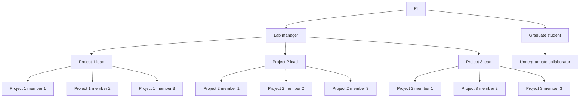

# Welcome to the O'Brien-Udry Lab!

## Overview

The O'Brien-Udry Lab is a group of undergraduates conducting research with Professor Cleo O'Brien-Udry.                                                                                                             
You can learn more about Professor O'Brien-Udry on her <a href = "http://cobrienudry.github.io/">website</a>. 

## Lab structure

Our 2025/6 lab manager is  <a href = "https://www.linkedin.com/in/ping-meunprasittiveg">Ping Meunprasittiveg</a>. 

## Ongoing projects

### Observing aid withdrawal: a dataset of aid withdrawal events from 1955 to 2022

Aid projects have a lengthy process of preparation, approval, and implementation. Approved projects are easily observable and the subject of much research on foreign aid, but what characterizes the projects that are not approved? I use monthly summaries of the status of pre-approval projects at the World Bank to track proposed projects, including projects that are not approved. Non-approved, henceforth “withdrawn," projects comprise 10% of all proposed World Bank projects from 1998 to 2014. These projects are more likely to be in the infrastructure sector and withdrawals are not associated with geopolitical variables. The evidence suggests that withdrawn projects may be a sign of agency within a recipient country. However, withdrawing projects delays the progress of future projects in the country. I provide a preliminary theory of aid compensation and composition in recipient countries in which aid withdrawal is a tool for recipients to align project aid with their priorities.

Project manager: 

### Superstar Bureaucrats from the Global South

A large and growing body of evidence suggests that individual bureaucrats who work for international financial institutions have an impact on their outcomes: high-quality bureaucrats produce high-quality results. Far less attention has been paid to the individual bureaucrats who represent client countries to these institutions. We use a novel source of data to identify the individuals that client countries designate as “contact points” to the World Bank. These bureaucrats, when associated with higher-quality projects early on, are associated with greater numbers of future projects and future projects of higher quality. We then show that client countries use “superstar” bureaucrats to strategically get more, and strategically targeted, projects. However, the success of these superstar bureaucrats also makes them targets for hiring by the World Bank and other international organizations. Using a new dataset of client country bureaucrat employment histories, we show that bureaucrats associated consistently with more successful projects are more likely to subsequently work for international actors. This, in turn, disrupts  recipient countries’ investments in bureaucratic quality. International organization brain drain undermines client countries’ ability to strategically target World Bank projects. 

Project manager: 

### Elections and agriculture

Poverty affects voting in developing countries—but poverty is not a static condition. Seasonal variation in income from agriculture dramatically affects incomes in developing states. How do variations in poverty affect political outcomes? And do politicians strategically manage these variations? Globally, we estimate the association between seasonally induced poverty and incumbent electoral success. We then map the temporal occurrence of elections across seasons to understand incumbent incentives to schedule elections in times of plenty. Using subnational variation in opium planting and harvesting seasons in Afghanistan, we estimate the causal effect of seasonal poverty on electoral outcomes, vote-buying patterns, and electoral violence. National and subnational data on climate change-induced changes in seasonal poverty patterns show how incumbents adapt to new information about political success as linked to large-scale changes in agriculture. Our findings highlight under explored dynamics in the political economy of development under climate change.

Project manager: 

### The political geography of the international energy transition in the Global South

What proportion of existing fossil fuel infrastructure in the Global South can be explained by political targeting compared to geographic endowments? How does this fossil fuel targeting affect countries’ ability or willingness to transition to renewable energy sources? Canonically, natural resources for energy generation are geographically determined--but renewable energy sources are more flexible in their potential locations. I examine the political determinants of energy generation projects before and during the international community’s green energy investment push. Using geolocated Chinese and World Bank-sponsored energy projects over time and measures of political targeting, including leader birth regions, ethnicities, and traditional voting blocs, I map the political geography of the energy transition in sub-Saharan Africa. Initial results indicate that, in countries where fossil fuel is disproportionately politically targeted compared to other aid projects, renewable energy projects are also disproportionately likely to be politically allocated.  Results are significantly stronger for Chinese projects—suggesting that domestic leaders are directing this political targeting. International efforts to support the green energy transition likely entrench local elites and raise questions about the efficacy of Just Energy Transition Partnerships.

Project manager: 

### Gendering climate in the Global South

Attitudes towards climate change in rich countries are gendered--women are significantly more concerned about the effects of climate than men--while in poor countries, the gap in climate beliefs is negligible. As rich countries sponsor climate mitigation and adaptation projects in the Global South, do donors export their gendered climate beliefs? We track the association between gender and climate aid projects over time to show that these two themes correlate more closely over time. Cross-national regressions in Africa and Latin America show an association between exposure to gendered climate aid and larger gaps in climate beliefs between men and women. We test the causal effect of gendering climate aid with a shift-share instrument leveraging different donors' proclivity to gender aid projects. Results are consistent with the globalization of gendered climate politics. These findings illustrate how donors' attempts to address inequities globally may inadvertently export cleavages in donor polities to the developing world.

Project manager: 

### Communal property rights and expropriation: evidence from gold mining in Ghana

How do land tenure structures affect communities’ or individuals’ ability to resist expropriation? We study the relationship between communal land tenure structures and collective action in the case of Ghana.

Project manager: 

### Ethnic Minority Aid

Project manager: 

### Graduate student project: 

Project manager: 

### Graduate student project: 

Project manager: 

