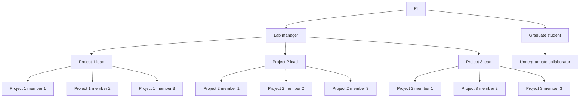

# Welcome to the O'Brien-Udry Lab!

## Overview

The O'Brien-Udry Lab is a group of undergraduates conducting research with Professor Cleo O'Brien-Udry.                                                                                                             

You can learn more about Professor O'Brien-Udry on her <a href = "http://cobrienudry.github.io/">website<\a>. 

## Lab structure

Our 2025/6 lab manager is  <a href = "https://www.linkedin.com/in/ping-meunprasittiveg">Ping Meunprasittiveg<\a>. 

## Ongoing projects

### Monthly Operational Summaries

### Bureaucrats

### Agriculture and Elections

### Global Energy Production

### Gender and Climate Aid

### Land Tenure and Mining

### Ethnic Minority Aid

### Graduate student project: 

### Graduate student project: 

